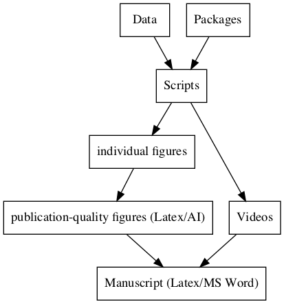

# A template for performing reproducible research  

***'Lack of replication and non-transparency decreases the value of research'*** [1]. 

When you present your work on some scientific journals or conferences, showing your data and  code is a crucial part of convincing readers to trust you. 

<!-- This repository is my template for performing individual scientific projects. I develop computational tools for processing neuroscience data, thus I hope all users can reproduce my results with the same packages and the same analysis pipeline.  -->
 
This repository is a template I used for organizing my research projects. It is based on the following pipeline of writing a scientific manuscript. 



Briefly, we save all the **data** and the **packages** used in this project, and then write **scripts** to load data and call packages for generating results like **Figures** and **Videos**. The figures can be further processed for generating publication-quality figures. In the last step, we use Latex or MS word for writing a scientific manuscript. 

## How to use this template
1. I manage each separate project as a git repository so that I can keep track of my work progresses. When I submit papers, I can provide the whole repository to support my analysis in the paper. 
2. I make **Manuscript** as a independent repository deployed on [Overleaf](https://www.overleaf.com/signup?ref=e1a13b4226a3) for collaborative writing. Thus the figures used in the project will be saved into a separate folder  **./Manuscript/Figs**. Since I usually change figures for the paper in the other **./Figures**, I created hard links for automatically sync'ing figures. 
   
3. The figures generated by scripts usually correspond to  single panels of the final figures seen in papers and are automatically saved to sub-folders of **./Figures**. This design makes it easy to simply changing one panel without modifying the rest panels. The I use latex to put all individual figures into some layouts for publication. I only have to change few lines of tex file when I want to change the layout. 

4. When I save a package used in the project and the package itself happen to be a github repository, I will save the git repository as a submodule of the project 
    ```sh 
    git submodule add package-git-address packages/package-name 
    ```
## Folder descriptions

1. **packages**: *all packages used for this research*.
2. **Data**: *data used in this project*   
3. **scripts**: *all scripts used for generating figures and videos for the paper*
4. **Figures**: *all figures used in the paper*
   Figures used in the paper are not the same as the figures generated by scripts.The former requires a layout of multiple panels and some illustration texts, while the later simply correspond to one panel of the usual Figure X in the paper. Here we used latex to create this layout because it allows us make small changes to the layout easily. All figures generated from scripts were saved into multiple sub-folders . 

5. **Videos**: *all videos used in the paper*
   
6. **Results**: *results after running scripts**
   You can avoid the step of re-running your scripts again if you want to generate more figures/videos using the same analysis. Simply loading the stored results make your life easier. 

7. **manuscripts**: *source files for the manuscript* 
   - main.tex: source file 
   - main.pdf: compiled file 
   - Figs: figures to be inserted. These figures should correspond to the upper level folder **Figures**. You we create links for binding them together. The reason that we don't put them into the same folder is that we want to keep this **Figs** folder clean. We only put things there when we need them. 
  
## An ideal example of reproduce research 

1. configure package paths
2. reproduce all figures 
   ```
   step 1: generate all individual figures 
   your code for reproducing figures
   ```

   ```
   step 2: compile tex files for generating publication-quality figures.
    compile figure1.tex 
   ```


3. compile manuscript 
   ```
   link all figures for the paper 
   compile main.tex 
   ```
Voila, you completely reproduced our research. checkout the manuscript here 
The paper: 📎 **you_manuscript.pdf**

# :smiley:


## References 
[1] Iqbal, S.A., Wallach, J.D., Khoury, M.J., Schully, S.D. and Ioannidis, J.P., 2016. Reproducible research practices and transparency across the biomedical literature. PLoS biology, 14(1), p.e1002333.

## Copyright
Pengcheng Zhou @Columbia University 
2018 

